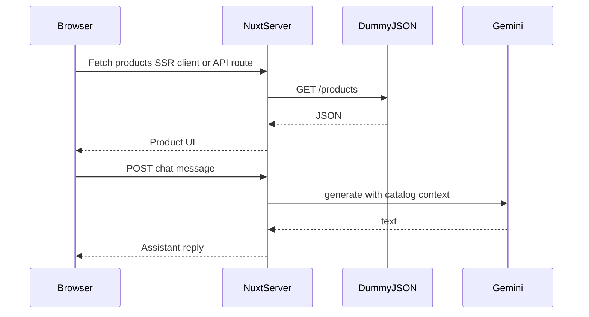

# Coding interview — Nuxt storefront + product assistant

Baseline app for a hands-on interview. **Scope and edge cases are clarified live on the call**; use this README for setup and the core goal only.

## Prerequisites

- **Node.js** 20+ (LTS recommended)
- **pnpm** (or use `npm` / `yarn` if you prefer — adjust commands)

## Setup

1. Clone the repo and install dependencies:

   ```bash
   pnpm install
   ```

2. Copy environment template and add your Gemini API key ([Google AI Studio](https://aistudio.google.com/)):

   ```bash
   cp .env.example .env
   ```

   Set `GEMINI_API_KEY` in `.env`. The key is read as **server-only** runtime config (`runtimeConfig.geminiApiKey` in `nuxt.config.ts`). **Do not** expose it to the client or call Gemini from the browser with this key.
   You can optionally set `GEMINI_MODEL` (default: `gemini-3.1-flash-lite-preview`).

3. Start the dev server:

   ```bash
   pnpm dev
   ```

4. Optional: confirm Nitro is running:

   ```bash
   curl http://localhost:3000/api/health
   ```

   Expect `{"ok":true}`.

## Stack (already configured)

- [Nuxt 3](https://nuxt.com/)
- [Tailwind CSS](https://tailwindcss.com/) (`@nuxtjs/tailwindcss`)
- [Reka UI](https://reka-ui.com/) (`reka-ui` + `reka-ui/nuxt` auto-imports)
- [@google/generative-ai](https://www.npmjs.com/package/@google/generative-ai) for Gemini on the **server** (e.g. `server/api/...`)

## Task

Build a **one-page** experience:

1. **Storefront**  
   Load product data from **[DummyJSON — products](https://dummyjson.com/products)** (consider `?limit=` for a predictable payload). Render a storefront-style layout.

2. **Design reference**  
   Match the **layout and visual direction** of this Figma file (duplicate if needed):  
   [Mock Product page](https://www.figma.com/design/9wQgbxJWDt3q8HzQsZtY3a/Mock-Product-page)

3. **Shopping assistant (chat)**  
   Let the user ask questions about the catalog. Answers must come from **Gemini**, with responses **grounded in the product data you fetched** — not generic ecommerce knowledge.

4. **Grounding rule**  
   If something is **not** in the loaded catalog data, the assistant should say it is not in the catalog (no invented SKUs, prices, or products).

5. **Replace the starter**  
   The default [`pages/index.vue`](pages/index.vue) is a placeholder; replace it with your implementation.

## Chatbot testing

We will **use the assistant like a shopper**: ask about specific products, compare options, probe details that only appear in the JSON (price, availability, descriptions, reviews, policies—whatever you surface in context), and occasionally ask about **things that are not in your loaded catalog**. We are not publishing a fixed script; the goal is to see whether answers **feel consistent with the data you actually have** rather than generic shop talk.

## Acceptance criteria (directional)

These are **guides**.

- **Catalog + UI:** Products come from DummyJSON; the page reads as a coherent storefront and is **aligned** with the Figma.
- **Assistant:** Chat goes through **your server**; the model is given enough catalog context to answer; replies should **track the dataset** (including saying when something is unknown or not in the catalog).
- **UX:** Obvious states (e.g. loading / failure / empty) are handled in a way you can explain; the flow is usable end-to-end for the demo.
- **Security:** Gemini credentials stay **server-side** only.

We will ask you to **walk through** how context is built, how errors are handled, and what you would tighten with more time.

## Architecture (what you implement)



On the server, use `useRuntimeConfig(event)` (or `useRuntimeConfig()` in server context) to read `geminiApiKey` — **only** in server code.


## Follow-ups
- I would improve the chat assistant UX using Streaming for its reponses, so it feels more responsive and dynamic. This would involve using the Gemini API's streaming capabilities and updating the frontend to handle and display streaming data.
- If I had access to the product catalog API code, I would implement pagination and filtering from there, rather than fetching a fixed batch of products. This would allow for a more scalable and user-friendly storefront, especially as the number of products grows. MORE IMPORTANTLY, it will also prevent the product catalog from being stale, as it would fetch the latest data on demand rather than relying on a single batch fetched at startup, specially important for filtering by availability status.
- Fetching and feeding the whole catalog on every chat request is not ideal for performance, but it ensures the data is always up to date, specially the product availability status, which is important for the user experience and can change frequently. In a real implementation, with a far bigger catalog, we would ideally have a more efficient way to query the catalog for relevant products based on the prompt and conversation history, rather than fetching everything and relying on Gemini to pick the relevant info. This could be done by implementing a search or filter API in the catalog service that Gemini can call to retrieve only the necessary data, or by using embeddings and vector search for better relevance.
- I would refactor the index page into smaller, reusable components to improve maintainability and readability. This would also make it easier to manage state and props across the application.
- I would implement FE e2e testing using a frameworks like Playwright(personally preferred) or Cypress.
- I would add error handling and loading states to the UI to enhance the user experience, especially when fetching product data or generating responses from Gemini. This would involve showing spinners or error messages as appropriate.
- I would experiment with different AI models and prompt engineering techniques to improve the quality and relevance of the assistant's responses.
- In a production scenario, where each product has a detailed page, I would link the "Product references" in the assistant's responses to the corresponding product pages, allowing users to easily navigate to the products being discussed in the chat.

## License

Private / interview use unless otherwise stated by the repository owner.
